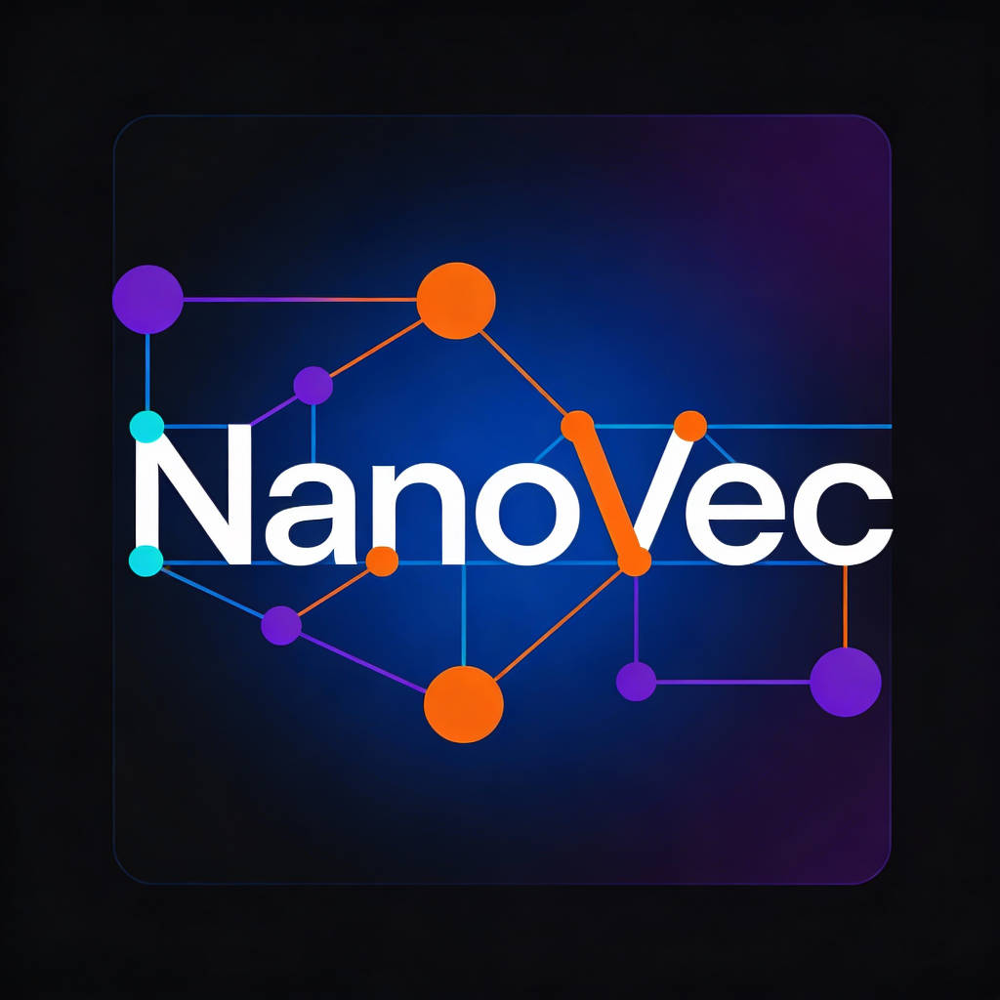

<p align="center">
  
</p>

# NanoVec

NanoVec est une base de données vectorielle légère et haute performance implémentée en Rust, conçue pour l'edge computing et les applications "offline-first". Elle utilise l'algorithme HNSW (Hierarchical Navigable Small World) pour une recherche de similitude efficace.

## Fonctionnalités

- **Ultra-rapide** : Utilise HNSW pour une recherche de similitude en temps logarithmique.
- **Efficace en mémoire** : Conçue pour gérer de grands ensembles de données même sur des appareils à RAM limitée.
- **Optimisée SIMD** : Exploite l'accélération matérielle pour les calculs de distance.
- **Support Multilingue** : Disponible en anglais et en français.
- **Architecture Modulaire** : Séparation claire entre les algorithmes de base, le stockage et l'API.

## Structure du Projet

- `core/` : Le "cerveau" de NanoVec, contenant la logique HNSW et les opérations vectorielles.
- `storage/` : Gère la persistance et les formats de fichiers binaires (`.nvec`).
- `api/` : Interface publique et bindings (ex: Python/Node.js).
- `cli/` : Interface en ligne de commande pour gérer et interroger les bases de données.

## Démarrage Rapide

### Prérequis

- Rust (Dernière version stable ou édition 2024)
- Cargo

### Installation

```bash
git clone https://github.com/yourusername/nanovec.git
cd nanovec
cargo build --release
```

### Utilisation

```bash
# Exemple de commande à venir
./target/release/nanovec-cli --help
```

## Documentation

Une documentation complète est disponible dans le dossier `docs/` :
- [Architecture](docs/architecture.md)
- [Guide de démarrage](docs/getting_started.md)

## Licence

Ce projet est sous licence selon les termes spécifiés dans le fichier LICENSE.
